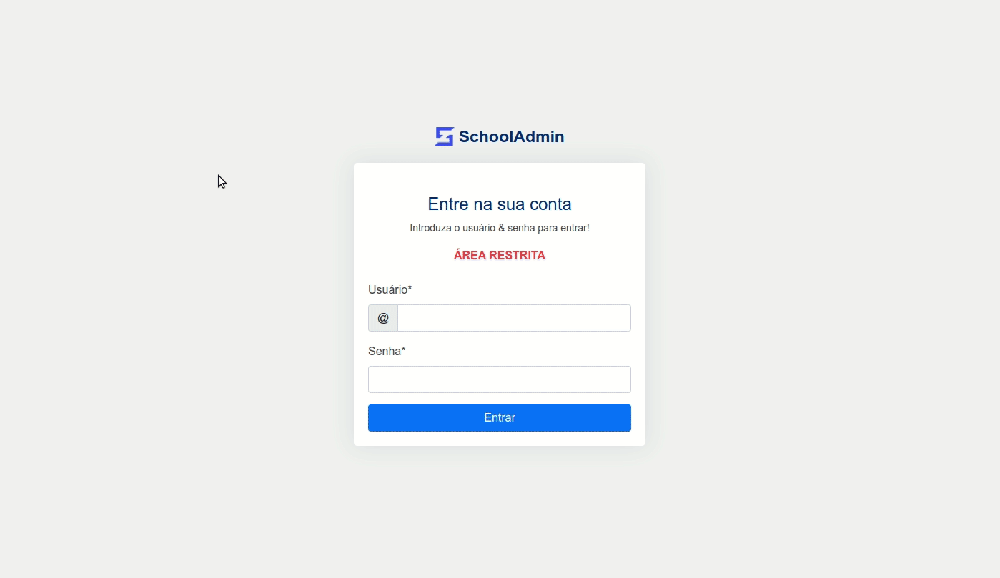

<p align="center">
  
</p>

<h1 align="center">
    
</h1>

<br>

## 🧪 Tecnológias

Este projeto foi desenvolvido utilizando as seguintes tecnologias:

- [HTML](https://www.w3schools.com/html/)
- [CSS3](https://www.w3schools.com/css/)
- [Bootstrap 5](https://getbootstrap.com/)
- [JavaScript](https://www.w3schools.com/js/)
- [EJS](https://ejs.co/)
- [Node.js](https://nodejs.org/en/)
- [MySQL](https://www.mysql.com/)


## 🚀 Começando

Clone o projeto e acesse a pasta.

```bash
$ git clone https://github.com/gabriel3p/schooladmin.git
$ cd schooladmin
```

Siga os passos abaixo:
```bash
# Instale as dependências
$ yarn

# Execute as migrations
$ yarn sequelize db:migrate

# Inicie o projeto
$ yarn start
```
O aplicativo estará disponível para acesso em seu navegador em http://localhost:5500

## 🔖 Descrição

<p>O Sistema de Gestão Escolar <strong>SchoolAdim</strong>  
foi desenvolvido e apresentado como projectop de conclusão de curso ao
Instituto Politécnico Privado Qinet - IPPQ, como requisito parcial para
obtenção do título de Técnico Médio.</p>

<p>
 O sistema permite ter mais controle e agilidade para sua gestão escolar
<br>Ou seja, é tudo o que é preciso para uma gestão escolar organizada, fácil e de qualidade em um único lugar.
</p>


## 📝 Licença

Este projeto está licenciado sob a Licença MIT. Consulte o arquivo [LICENSE](LICENSE.md) para obter detalhes.


---

<p align="center">Made with 💜 by Gabriel Pereira</p>
